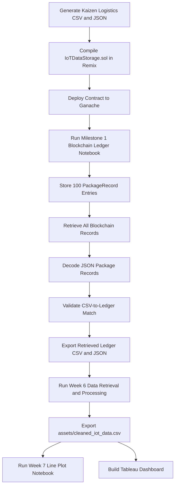
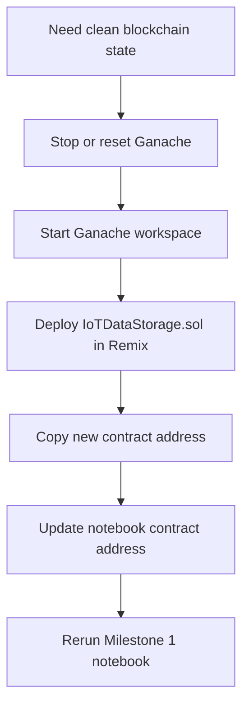

# Developer Guide

This guide is for team members who need to run, adjust, or troubleshoot the Smart Logistics Tracking notebooks in this repository.

## Project purpose

The project simulates package-level logistics data for **Kaizen Logistics**, stores 100 IoT package records on a local blockchain through Ganache and Remix, retrieves the blockchain records into Python, validates the retrieved ledger against the original CSV, cleans the data for analysis, and prepares the outputs for Python and Tableau visualizations.

## Current workflow overview



## Main files and responsibilities

| File | Purpose |
|---|---|
| `IOT Data Simulation/smart_logistics_tracker_japan_kaizenlogistics.ipynb` | Generates the mock Japan logistics dataset for Kaizen Logistics. |
| `IOT Data Simulation/smart_logistics_tracker_japan_kaizenlogistics.csv` | Source CSV used for blockchain storage. |
| `IOT Data Simulation/smart_logistics_tracker_japan_kaizenlogistics.json` | JSON copy of the source logistics records. |
| `contracts/IoTDataStorage.sol` | Solidity smart contract for storing IoT package records. |
| `contracts/abi.json` | ABI exported from Remix after compiling the latest contract. |
| `IOT Data Simulation/MS1_Smart_Tracking_System_Blockchain_Ledger_Submission_TeamKaizen.ipynb` | Connects Python to Ganache, stores all 100 source records, retrieves the ledger, validates records, and exports blockchain output files. |
| `IOT Data Simulation/kaizenlogistics_blockchain_ledger_retrieved.csv` | Retrieved and decoded blockchain ledger records in CSV format. |
| `IOT Data Simulation/kaizenlogistics_blockchain_ledger_retrieved.json` | Retrieved and decoded blockchain ledger records in JSON format. |
| `IOT Data Simulation/kaizenlogistics_blockchain_transactions.csv` | Transaction hash log for the blockchain write process. |
| `week_6_HomeworkDataRetrievalandProcessing.ipynb` | Cleans and processes the retrieved ledger records for visualization readiness. |
| `assets/cleaned_iot_data.csv` | Final cleaned Week 6 output used by Week 7 and visualization work. |
| `week7_LinePlotofIoTSensorReadingsOverTime.ipynb` | Produces line plots for IoT sensor readings over time. |

## Environment setup

Use a virtual environment or Conda environment, then install the required packages:

```bash
source .venv/bin/activate
python3 -m pip install jupyter pandas numpy matplotlib seaborn web3 python-dotenv
```

If using Conda, activate the correct environment first:

```bash
conda activate <environment-name>
python -m pip install jupyter pandas numpy matplotlib seaborn web3 python-dotenv
```

If dependencies change, update `requirements.txt` if the team is maintaining one:

```bash
python -m pip freeze > requirements.txt
```

## Ganache and Remix setup

1. Open Ganache.
2. Start a local workspace or Quickstart Ethereum chain.
3. Confirm the RPC server shown in Ganache, commonly:

```text
http://127.0.0.1:7545
```

or:

```text
http://127.0.0.1:8545
```

4. Open Remix IDE.
5. Open or create `IoTDataStorage.sol`.
6. Paste the latest contents from `contracts/IoTDataStorage.sol`.
7. Compile using Solidity `0.8.0` or a compatible `0.8.x` compiler.
8. Under **Deploy & Run Transactions**, select **External HTTP Provider**.
9. Enter the Ganache RPC URL.
10. Deploy the contract.
11. Copy the deployed contract address into the Milestone 1 notebook.
12. Export or copy the latest ABI into `contracts/abi.json`.

## Smart contract storage format

The current blockchain approach stores one smart contract record per package row.

Each blockchain record uses the contract fields:

```text
timestamp
package_id
data_type
data_value
```

For the Kaizen Logistics dataset:

- `package_id` contains the package identifier, such as `PKG001`.
- `data_type` is stored as `PackageRecord`.
- `data_value` stores the full package row as a JSON string.

This lets the project preserve the full CSV row while still using the simple contract structure from the coursework template.

## Milestone 1 notebook flow

Notebook:

```text
IOT Data Simulation/MS1_Smart_Tracking_System_Blockchain_Ledger_Submission_TeamKaizen.ipynb
```

Recommended run order:

1. Import libraries.
2. Load the source CSV.
3. Inspect the dataset structure.
4. Connect Python to Ganache.
5. Load the smart contract ABI and contract address.
6. Confirm the sender account.
7. Store all 100 CSV package rows as blockchain records.
8. Save transaction hashes.
9. Retrieve the total number of stored records.
10. Retrieve all blockchain ledger records.
11. Decode JSON package records.
12. Validate the decoded ledger records against the source CSV.
13. Preview a worksheet-friendly retrieved record.
14. Save retrieved blockchain outputs as CSV and JSON.

Expected source input:

```text
IOT Data Simulation/smart_logistics_tracker_japan_kaizenlogistics.csv
```

Expected outputs:

```text
IOT Data Simulation/kaizenlogistics_blockchain_ledger_retrieved.csv
IOT Data Simulation/kaizenlogistics_blockchain_ledger_retrieved.json
IOT Data Simulation/kaizenlogistics_blockchain_transactions.csv
```

## Week 6 notebook flow

Notebook:

```text
week_6_HomeworkDataRetrievalandProcessing.ipynb
```

Purpose:

- retrieve or load the Milestone 1 blockchain ledger output,
- decode and structure package records,
- remove blockchain-only columns that are not needed for visualization,
- standardize numeric formatting where appropriate,
- preserve latitude and longitude precision,
- prepare the dataset for Week 7 and visualization tasks,
- export the cleaned CSV to the `assets/` folder.

Expected output:

```text
assets/cleaned_iot_data.csv
```

Important cleaning notes:

- Keep timestamp and date fields in readable datetime format.
- Keep temperature and percent fields numeric.
- Format non-coordinate decimal fields consistently to 2 decimal places when exported.
- Preserve latitude and longitude precision for Tableau map plotting.
- Keep blank or missing exception reasons consistent with the dataset logic.

## Week 7 notebook flow

Notebook:

```text
week7_LinePlotofIoTSensorReadingsOverTime.ipynb
```

Purpose:

- load `assets/cleaned_iot_data.csv`,
- convert timestamp fields to datetime,
- create clean line plot visualizations for IoT readings over time,
- support the dashboard story by showing package temperature and sensor trends.

Expected input:

```text
assets/cleaned_iot_data.csv
```

## Tableau dashboard workflow

The Tableau dashboard is published here:

[Kaizen Logistics Smart Package Monitoring & Tracking Dashboard](https://public.tableau.com/views/MO-IT148Milestone2SmartTrackingSystemDashboardSubmissionS3101TeamKaizen/MAINDASHBOARD?:language=en-US&:sid=&:redirect=auth&:display_count=n&:origin=viz_share_link)

Recommended Tableau dashboard pages:

1. **Kaizen Logistics Smart Package Monitoring & Tracking Dashboard**
2. **Executive Overview**
3. **Sensor Monitoring**
4. **Exception Monitoring**

Recommended main dashboard story:

- KPI cards summarize package volume, delivery rate, average temperature, and perishable packages.
- Japan route map shows package movement across Japan.
- Temperature condition by journey stage shows where temperature risks appear during the logistics flow.
- Temperature condition distribution summarizes Ambient, Cool, and Danger Zone shares.
- Filters allow users to inspect package ID, perishable status, final status, event status, and event timestamp.

## Path conventions

Use relative paths from the repository root where possible.

Recommended paths:

```text
contracts/IoTDataStorage.sol
contracts/abi.json
IOT Data Simulation/smart_logistics_tracker_japan_kaizenlogistics.csv
IOT Data Simulation/kaizenlogistics_blockchain_ledger_retrieved.csv
assets/cleaned_iot_data.csv
```

Avoid hardcoding local machine paths such as:

```text
/Users/<username>/...
```

Local absolute paths can break when another teammate clones the repository.

## Common problems and fixes

### Python cannot connect to Ganache

Check the RPC URL in the notebook. Ganache may use either `7545` or `8545` depending on the workspace.

Try:

```text
http://127.0.0.1:7545
```

or:

```text
http://127.0.0.1:8545
```

Also confirm that Ganache is open and the workspace is running.

### Remix External HTTP Provider does not connect

Use the exact RPC server shown in Ganache. If Ganache shows port `7545`, enter:

```text
http://127.0.0.1:7545
```

Do not use a different port unless Ganache is configured for it.

### Gas estimation failed during deploy

This may happen when the selected compiler, provider, or contract state is mismatched.

Recommended checks:

1. Confirm Ganache is running.
2. Confirm Remix is connected to the correct RPC URL.
3. Compile the contract again.
4. Confirm the selected contract is `IoTDataStorage`.
5. Deploy with a Ganache account that has test ETH.
6. If needed, restart Ganache and redeploy.

### Contract address error

A Ganache contract address is only valid for the current Ganache chain state. If Ganache is restarted or reset, the old deployed contract address may no longer work.

Fix:

1. Redeploy the contract in Remix.
2. Copy the new contract address.
3. Update the contract address in the notebook.
4. Rerun the notebook cells from the contract setup step.

### ABI mismatch

If the Python notebook cannot call the expected smart contract functions, the ABI may not match the deployed contract.

Fix:

1. Recompile the latest `IoTDataStorage.sol` in Remix.
2. Copy the latest ABI.
3. Replace `contracts/abi.json`.
4. Redeploy the contract if needed.
5. Rerun the contract setup cell.

### CSV file not found

Confirm that the notebook is being run from the repository root and that the file exists in the expected folder.

Common expected paths:

```text
IOT Data Simulation/smart_logistics_tracker_japan_kaizenlogistics.csv
assets/cleaned_iot_data.csv
```

### CSV-to-ledger validation fails

Possible causes:

- The source CSV changed after blockchain storage.
- The contract already contained records from a previous run.
- The wrong contract address was used.
- Records were retrieved from an older Ganache deployment.

Fix:

1. Confirm the source CSV is the correct version.
2. Restart Ganache if a fresh chain is needed.
3. Redeploy the contract.
4. Update the contract address.
5. Rerun Milestone 1 from the beginning.

### Exported CSV has blank cells instead of `None`

Blank values are normal CSV behavior for missing values. For visualization, Tableau and Python can interpret them as null or blank values. If a literal string is required, replace missing values before export with:

```python
df = df.fillna("None")
```

Use this only when the output needs the text value `None`, because replacing nulls with text can affect numeric or analytical processing.

## Resetting for a clean blockchain run

If the blockchain needs to be cleared, restart Ganache and redeploy the smart contract. The current contract does not include a reset or delete function.



## Suggested branch workflow

For a new set of updates:

```bash
git checkout main
git pull origin main
git checkout -b feature/update-logistics-docs-and-dashboard-assets
```

After edits:

```bash
git status
git add README.md DEVELOPER_GUIDE.md assets/cleaned_iot_data.csv "IOT Data Simulation" contracts

git commit -m "docs: update logistics tracking project documentation"
git push origin feature/update-logistics-docs-and-dashboard-assets
```

Then open a pull request into `main` or into the team integration branch, depending on the agreed workflow.

## Editing tips

- Keep paths relative to the repository root.
- Update `README.md` when the project structure changes.
- Update this guide when notebook steps, contract logic, or output files change.
- Keep notebook outputs readable enough for worksheet screenshots.
- Keep dashboard-related exports separate from homework outputs when the Tableau data requires additional fields.
- Do not commit `.env`, notebook checkpoints, or machine-specific files.
