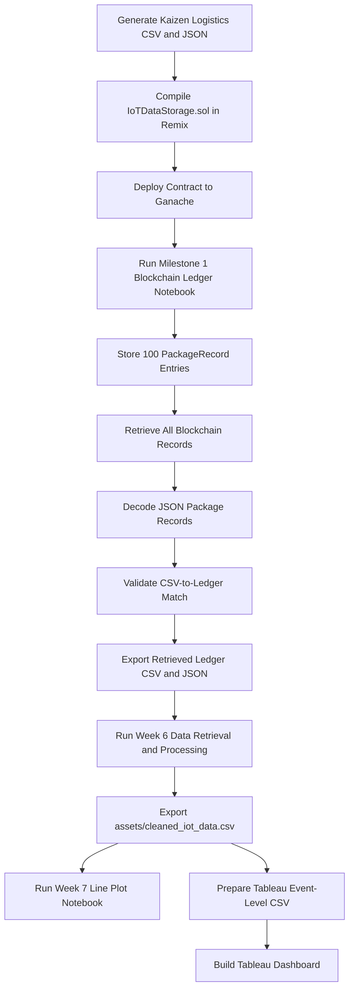

# Developer Guide

This guide is for team members who need to run, adjust, or troubleshoot the **Kaizen Logistics Smart Package Monitoring & Tracking** workflow.

## Project purpose

The project simulates package-level logistics data for **Kaizen Logistics**, stores 100 IoT package records on a local blockchain through Ganache and Remix, retrieves the blockchain records into Python, validates the retrieved ledger against the original CSV, cleans the data for analysis, and prepares the outputs for Week 7 line plots and Tableau dashboard visualization.

## Current workflow overview



## Main files and responsibilities

| File | Purpose |
|---|---|
| `IOT Data Simulation/smart_logistics_tracker_japan_kaizenlogistics.ipynb` | Generates the mock Japan logistics dataset for Kaizen Logistics. |
| `IOT Data Simulation/smart_logistics_tracker_japan_kaizenlogistics.csv` | Source CSV used for blockchain storage. |
| `IOT Data Simulation/smart_logistics_tracker_japan_kaizenlogistics.json` | JSON copy of the source logistics records. |
| `contracts/IoTDataStorage.sol` | Solidity smart contract for storing IoT package records. |
| `contracts/abi.json` | ABI exported from Remix after compiling the latest contract. |
| `IOT Data Simulation/MS1_Smart_Tracking_System_Blockchain_Ledger_Submission_TeamKaizen.ipynb` | Connects Python to Ganache, stores all 100 source records, retrieves the ledger, validates records, and exports blockchain output files. |
| `IOT Data Simulation/kaizenlogistics_blockchain_ledger_retrieved.csv` | Retrieved and decoded blockchain ledger records in CSV format. |
| `IOT Data Simulation/kaizenlogistics_blockchain_ledger_retrieved.json` | Retrieved and decoded blockchain ledger records in JSON format. |
| `IOT Data Simulation/kaizenlogistics_blockchain_transactions.csv` | Transaction hash log for the blockchain write process. |
| `week_6_HomeworkDataRetrievalandProcessing.ipynb` | Cleans and processes retrieved ledger records for visualization readiness. |
| `assets/cleaned_iot_data.csv` | Final cleaned Week 6 output used by Week 7. |
| `week7_LinePlotofIoTSensorReadingsOverTime.ipynb` | Produces line plots for IoT sensor readings over time. |
| `tableau_kaizen_logistics_tracking_events.csv` | Tableau-specific event-level data for route tracking and dashboard interactivity. |
| `docs/IMPROVEMENTS.md` | Improvement log for the current project state. |
| `docs/tableau_storytelling_iot_sensors.md` | Tableau dashboard storyboard, layout, color scheme, and talking points. |

## Environment setup

Use a virtual environment or Conda environment, then install the required packages:

```bash
python -m pip install jupyter pandas numpy matplotlib seaborn web3 python-dotenv
```

If using Conda:

```bash
conda activate <environment-name>
python -m pip install jupyter pandas numpy matplotlib seaborn web3 python-dotenv
```

If dependencies change and the team is maintaining a `requirements.txt`, update it with:

```bash
python -m pip freeze > requirements.txt
```

## Path conventions

Use relative paths from the repository root when possible.

Recommended paths:

```text
contracts/IoTDataStorage.sol
contracts/abi.json
IOT Data Simulation/smart_logistics_tracker_japan_kaizenlogistics.csv
IOT Data Simulation/smart_logistics_tracker_japan_kaizenlogistics.json
IOT Data Simulation/kaizenlogistics_blockchain_ledger_retrieved.csv
IOT Data Simulation/kaizenlogistics_blockchain_ledger_retrieved.json
IOT Data Simulation/kaizenlogistics_blockchain_transactions.csv
assets/cleaned_iot_data.csv
tableau_kaizen_logistics_tracking_events.csv
```

Avoid hardcoding local machine paths such as:

```text
/Users/<username>/...
```

Local absolute paths can break when another teammate clones the repository.

## Ganache and Remix setup

1. Open Ganache.
2. Start a local workspace or Quickstart Ethereum chain.
3. Confirm the RPC server shown in Ganache. It is commonly one of these:

```text
http://127.0.0.1:7545
http://127.0.0.1:8545
```

4. Open Remix IDE.
5. Open or create `IoTDataStorage.sol`.
6. Paste the latest contents from `contracts/IoTDataStorage.sol`.
7. Compile using Solidity `0.8.0` or a compatible `0.8.x` compiler.
8. Under **Deploy & Run Transactions**, select **External HTTP Provider**.
9. Enter the Ganache RPC URL.
10. Deploy the contract.
11. Copy the deployed contract address into the Milestone 1 notebook.
12. Export or copy the latest ABI into `contracts/abi.json`.

## Smart contract storage format

The current blockchain approach stores **one smart contract record per package row**.

Each blockchain record uses the contract fields:

```text
timestamp
package_id
data_type
data_value
```

For the Kaizen Logistics dataset:

- `package_id` contains the package identifier, such as `PKG001`.
- `data_type` is stored as `PackageRecord`.
- `data_value` stores the full package row as a JSON string.

This lets the project preserve the full CSV row while still using a simple contract structure suitable for the coursework template.

## Milestone 1 notebook flow

Notebook:

```text
IOT Data Simulation/MS1_Smart_Tracking_System_Blockchain_Ledger_Submission_TeamKaizen.ipynb
```

Recommended run order:

1. Import libraries.
2. Load the source CSV.
3. Inspect the dataset structure.
4. Connect Python to Ganache.
5. Load the smart contract ABI and contract address.
6. Confirm the sender account.
7. Store all 100 CSV package rows as blockchain records.
8. Save transaction hashes.
9. Retrieve the total number of stored records.
10. Retrieve all blockchain ledger records.
11. Decode JSON package records.
12. Validate the decoded ledger records against the source CSV.
13. Preview a worksheet-friendly retrieved record.
14. Save retrieved blockchain outputs as CSV and JSON.

Expected source input:

```text
IOT Data Simulation/smart_logistics_tracker_japan_kaizenlogistics.csv
```

Expected outputs:

```text
IOT Data Simulation/kaizenlogistics_blockchain_ledger_retrieved.csv
IOT Data Simulation/kaizenlogistics_blockchain_ledger_retrieved.json
IOT Data Simulation/kaizenlogistics_blockchain_transactions.csv
```

## Important Milestone 1 validation notes

The decoded ledger output should preserve the original CSV column order when exported.

The validation step should confirm:

```text
CSV-to-ledger record match: True
All 100 CSV records match the retrieved blockchain ledger records.
```

If the validation fails, check:

1. Whether the source CSV was changed after blockchain storage.
2. Whether the decoded ledger column order matches the source CSV.
3. Whether blank values and `nan` values were handled consistently.
4. Whether the contract address points to the correct deployed contract.

## Week 6 notebook flow

Notebook:

```text
week_6_HomeworkDataRetrievalandProcessing.ipynb
```

Purpose:

- load or retrieve the Milestone 1 blockchain ledger output,
- decode and structure package records,
- remove blockchain-only helper columns that are not needed for visualization,
- standardize numeric formatting where appropriate,
- preserve latitude and longitude precision,
- prepare the dataset for Week 7 and visualization tasks,
- export the cleaned CSV to the `assets/` folder.

Expected output:

```text
assets/cleaned_iot_data.csv
```

Important cleaning notes:

- Keep timestamp and date fields in readable datetime format.
- Keep temperature and percent fields numeric.
- Format non-coordinate decimal fields consistently to 2 decimal places when exported.
- Preserve latitude and longitude precision for Tableau map plotting.
- Keep missing exception reasons consistent with the dataset logic.
- Do not overwrite the official Week 6 output only for Tableau experimentation. Use a separate Tableau CSV for dashboard-specific needs.

## Week 7 notebook flow

Notebook:

```text
week7_LinePlotofIoTSensorReadingsOverTime.ipynb
```

Purpose:

- load `assets/cleaned_iot_data.csv`,
- convert timestamp fields to datetime,
- create clean line plot visualizations for IoT sensor readings over time,
- support the dashboard story by showing package temperature and sensor trends.

Expected input:

```text
assets/cleaned_iot_data.csv
```

Recommended Week 7 chart focus:

- temperature over time,
- temperature by package status,
- temperature by perishable classification,
- clean date/time labels,
- readable titles and axis labels.

## Tableau dashboard workflow

The Tableau dashboard is published here:

[Kaizen Logistics Smart Package Monitoring & Tracking Dashboard](https://public.tableau.com/views/MO-IT148Milestone2SmartTrackingSystemDashboardSubmissionS3101TeamKaizen/MAINDASHBOARD?:language=en-US&:sid=&:redirect=auth&:display_count=n&:origin=viz_share_link)

Use the Tableau-specific event-level CSV for dashboard construction:

```text
tableau_kaizen_logistics_tracking_events.csv
```

This CSV supports:

- one row per tracking event,
- route path ordering,
- event status coloring,
- map tooltips,
- dashboard filters,
- KPI calculations,
- sensor monitoring charts,
- exception monitoring charts.

Recommended Tableau dashboard pages:

1. **Kaizen Logistics Smart Package Monitoring & Tracking Dashboard**
2. **Executive Overview**
3. **Sensor Monitoring**
4. **Exception Monitoring**

Recommended main dashboard story:

- KPI cards summarize package volume, delivery rate, average temperature, and perishable packages.
- Japan route map shows package movement across Japan.
- Temperature condition by journey stage shows where temperature risks appear during the logistics flow.
- Temperature condition distribution summarizes Ambient, Cool, and Danger Zone shares.
- Filters allow users to inspect package ID, perishable status, final status, event status, and event timestamp.

## Tableau map setup notes

Recommended map title:

```text
Japan Smart Shipment Route Map
```

Recommended dual-layer setup:

### Route line layer

```text
Marks Type: Line
Detail: map_path_id, package_id
Path: map_path_order
Color: muted gray or final_status
Size: thin
Opacity: 35% to 45%
```

### Event point layer

```text
Marks Type: Circle
Color: event_status
Detail: package_id, event_type
Tooltip: package, event, location, timestamp, temperature, RFID, final status, exception reason
```

Recommended route line color for the main dashboard:

```text
#8A8A8A
```

This keeps the all-packages route map readable and prevents the map from overwhelming the dashboard.

## Suggested Tableau color scheme

### Base dashboard theme

| Use | Hex |
|---|---:|
| Brand dark red | `#B00000` |
| Dark maroon | `#7A0000` |
| White panel | `#FFFFFF` |
| Light gray background | `#E6E6E6` |
| Medium gray border | `#C9C9C9` |
| Dark text | `#333333` |

### Temperature condition colors

| Temperature Issue | Hex |
|---|---:|
| Ambient | `#BFC0C0` |
| Cool | `#6C8EA4` |
| Danger Zone | `#B00000` |

### Event status colors

| Event Status | Hex |
|---|---:|
| Order Placed | `#BFC0C0` |
| Picked Up | `#D9A441` |
| In Transit | `#A65E00` |
| Out for Delivery | `#9E3D3F` |
| Delivered | `#5E6F64` |
| Not Delivered | `#B00000` |

## Common problems and fixes

### Python cannot connect to Ganache

Check the RPC URL in the notebook. Ganache may use either `7545` or `8545` depending on the workspace.

Try:

```text
http://127.0.0.1:7545
```

or:

```text
http://127.0.0.1:8545
```

Also confirm that Ganache is running before executing the notebook.

### Contract address does not work

Possible causes:

- Ganache was restarted and the old contract no longer exists.
- The notebook is pointing to a contract address from a previous chain session.
- The ABI does not match the deployed contract.

Fix:

1. Redeploy the contract in Remix.
2. Copy the new contract address.
3. Confirm `contracts/abi.json` matches the deployed contract.
4. Rerun the notebook from the contract setup cell.

### `Not authorized`

The notebook is sending transactions from the wrong account.

Fix:

1. Make sure the deployed contract owner account is available in Ganache.
2. Set the sender account to the deployer account.
3. Rerun the contract setup cell.

### Contract storage is already full

The smart contract has reached its maximum entries.

Fix:

1. Restart Ganache for a clean local chain.
2. Redeploy the contract.
3. Update the contract address in the notebook.
4. Rerun the notebook from the start.

### CSV-to-ledger validation fails

Check:

- source CSV file path,
- column order,
- blank or missing values,
- whether the blockchain ledger was generated from the same source CSV,
- whether package IDs were sorted consistently before comparison.

### Tableau route map looks messy

For the main dashboard:

- use thin gray route lines,
- lower route line opacity,
- keep event status colors on circle points,
- remove package labels unless filtering to one package,
- use the `Package Id` filter to inspect individual journeys.

## Documentation maintenance checklist

Update these files when major workflow changes are made:

```text
README.md
DEVELOPER_GUIDE.md
docs/IMPROVEMENTS.md
docs/tableau_storytelling_iot_sensors.md
```

Update documentation when:

- dataset filenames change,
- notebook filenames change,
- smart contract logic changes,
- ABI path changes,
- Tableau dashboard link changes,
- output CSV/JSON filenames change,
- dashboard story or layout changes.
