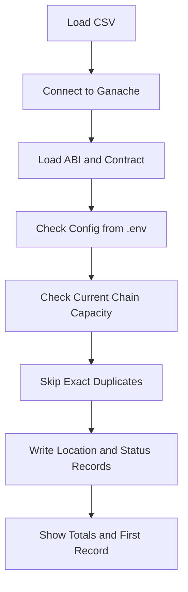
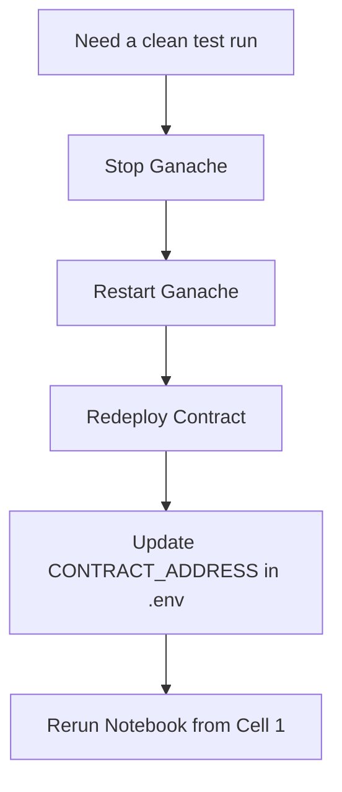

# Developer Guide

This guide is for junior engineers who need to run, adjust, or troubleshoot the blockchain notebook in this repo.

## What this project does

The main notebook, [MS1_Smart_Tracking_System_Blockchain_Ledger_Submission_TeamKaizen.ipynb](MS1_Smart_Tracking_System_Blockchain_Ledger_Submission_TeamKaizen.ipynb), loads IoT logistics data from CSV, connects to a local Ganache chain, and writes selected records to a smart contract.

The notebook currently does four important things:

1. Loads the CSV and shows the first 5 rows.
2. Connects to Ganache.
3. Loads the deployed contract using the ABI in [contracts/abi.json](contracts/abi.json).
4. Writes data to the chain while avoiding duplicate exact records and respecting the contract’s record limit.



## Setup

Use the project virtual environment and install the notebook dependencies:

```bash
source .venv/bin/activate
python3 -m pip install jupyter pandas numpy matplotlib
```

Before running the notebook, copy [/.env.example](.env.example) to [/.env](.env) and update the values for your local Ganache chain and contract.

If you need to freeze dependencies after a change, run:

```bash
source .venv/bin/activate && pip freeze > requirements.txt
```

## Environment Variables

The notebook reads configuration from `.env` if the values are not already exported in your shell.

Example values:

```dotenv
GANACHE_URL=http://127.0.0.1:8545
CONTRACT_ADDRESS=0x...
CONTRACT_OWNER=0x...
TARGET_CONTRACT_RECORDS=100
CSV_PATH=IOT Data Simulation/smart_logistic_tracker_japan.csv
ABI_PATH=contracts/abi.json
SAMPLE_ROWS=5
WRITE_DELAY_SECONDS=0.1
WRITE_GAS_LIMIT=3000000
ENABLE_DUPLICATE_WRITES=false
```

### Variable meanings

- `GANACHE_URL`: Ganache RPC URL. The default local value is `http://127.0.0.1:8545`.
- `CONTRACT_ADDRESS`: The deployed smart contract address for the notebook session.
- `CONTRACT_OWNER`: Optional override for the sending account. Use this if the on-chain owner is not unlocked in Ganache.
- `TARGET_CONTRACT_RECORDS`: The number of on-chain records the notebook should try to write in a run.
- `CSV_PATH`: Path to the CSV file that the notebook loads.
- `ABI_PATH`: Path to the ABI file for the deployed contract.
- `SAMPLE_ROWS`: Number of rows shown in the preview cell.
- `WRITE_DELAY_SECONDS`: Delay between each transaction.
- `WRITE_GAS_LIMIT`: Gas limit used for each transaction.
- `ENABLE_DUPLICATE_WRITES`: Set to `true` when you want to force exact duplicates to be written.

### Important detail

The notebook writes **two contract records per CSV row**:

- one `Location` record
- one `Status` record

That means `TARGET_CONTRACT_RECORDS=100` tries to write about 50 CSV rows.

## Notebook Flow

Run the cells in this order:

1. Load the CSV.
2. Connect to Ganache.
3. Load the ABI and contract.
4. Store the data.
5. Check totals.
6. View the first stored record.

### Cell 1: CSV load

This cell reads the CSV path from `.env`, prints the total row count, and shows the first `SAMPLE_ROWS` records.

It also has basic error handling for:

- missing file
- empty file
- parser errors
- unexpected exceptions

If the CSV fails to load, `df` becomes an empty DataFrame so later cells do not crash immediately.

### Cell 3: Contract setup

This cell reads the contract address from `.env`, loads the ABI from `ABI_PATH`, creates the contract instance, and sets the sender account.

If the on-chain owner is not unlocked in Ganache, you must set `CONTRACT_OWNER` to an unlocked account.

### Cell 4: Write data

This cell does the actual storage work.

It now:

- checks whether an exact record already exists before writing
- respects the contract’s `MAX_ENTRIES`
- respects `TARGET_CONTRACT_RECORDS`
- stops early if the contract is full

Because each CSV row produces two records, the row count is calculated carefully so the notebook does not overrun the contract.

The write loop also uses `WRITE_DELAY_SECONDS` and `WRITE_GAS_LIMIT` from `.env`.

## Common Problems

### `CSV file not found`

Check that you are running the notebook from the repository root and that the file path in Cell 1 is correct:

```python
IOT Data Simulation/smart_logistic_tracker_japan.csv
```

### `Not authorized`

The notebook is sending transactions from the wrong account.

Fix:

1. Make sure Ganache is running.
2. Confirm the owner account is unlocked.
3. Set `CONTRACT_OWNER` in `.env` if needed.

### `Storage limit reached`

The contract has reached `MAX_ENTRIES`.

Fix:

1. Restart Ganache for a clean chain, or
2. Redeploy the contract and update `CONTRACT_ADDRESS` in `.env`.

### Duplicate rows are skipped

This is expected. The notebook checks the exact `package_id + data_type + data_value` combination before writing.

If you want to test duplicate writes on purpose, set `ENABLE_DUPLICATE_WRITES=true` in `.env`. In that mode the notebook will stop skipping exact duplicates and will write them again.

## Resetting for a fresh test run

If you want to test again from a clean state:

1. Stop Ganache.
2. Restart Ganache.
3. Redeploy the contract.
4. Update `CONTRACT_ADDRESS` in `.env`.
5. Rerun the notebook from Cell 1.

This is the only true way to clear all 500 entries, because the current contract does not include a reset or delete function.



## Editing tips

- Keep environment-specific values in `.env`, not hardcoded in the notebook.
- Keep changes small and rerun the edited notebook cell after each change.
- When adding a new setting, document it here and in the README.
