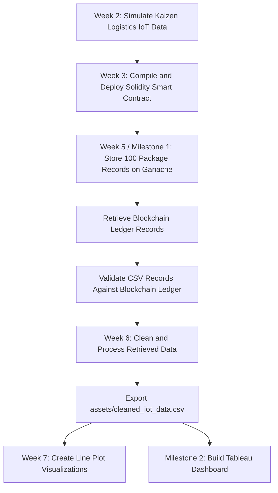

# ADET Smart Logistics Tracking System


This repository contains Team Kaizen's **Smart Logistics Tracking System** project for MO-IT148. The project simulates IoT-enabled logistics data for **Kaizen Logistics**, stores package records on a local blockchain using Ganache and a Solidity smart contract, retrieves and cleans the blockchain records, and visualizes the final logistics insights through Python and Tableau.

The project story focuses on a Japan-based logistics company that monitors package movement, delivery status, temperature condition, perishable handling, and RFID tracking reliability.

## Tableau Dashboard

View the Milestone 2 Tableau dashboard here:

[Kaizen Logistics Smart Package Monitoring & Tracking Dashboard](https://public.tableau.com/views/MO-IT148Milestone2SmartTrackingSystemDashboardSubmissionS3101TeamKaizen/MAINDASHBOARD?:language=en-US&:sid=&:redirect=auth&:display_count=n&:origin=viz_share_link)

## Developer guide

If you are working on the blockchain notebook, start with [DEVELOPER_GUIDE.md](DEVELOPER_GUIDE.md). It explains the repository flow, Ganache connection, smart contract setup, notebook execution order, output files, and common troubleshooting steps.

## Current project layout

```text
adet/
├── archive/
│   └── older draft notebooks and reference files
├── assets/
│   └── cleaned_iot_data.csv
├── contracts/
│   ├── IoTDataStorage.sol
│   └── abi.json
├── docs/
│   └── project documentation and improvement notes
├── IOT Data Simulation/
│   ├── kaizenlogistics_blockchain_ledger_retrieved.csv
│   ├── kaizenlogistics_blockchain_ledger_retrieved.json
│   ├── kaizenlogistics_blockchain_transactions.csv
│   ├── smart_logistics_tracker_japan_kaizenlogistics.csv
│   ├── smart_logistics_tracker_japan_kaizenlogistics.ipynb
│   ├── smart_logistics_tracker_japan_kaizenlogistics.json
│   └── MS1_Smart_Tracking_System_Blockchain_Ledger_Submission_TeamKaizen.ipynb
├── README.md
├── DEVELOPER_GUIDE.md
├── CONTRIBUTING.md
├── week_6_HomeworkDataRetrievalandProcessing.ipynb
└── week7_LinePlotofIoTSensorReadingsOverTime.ipynb
```

## Main files

| File / Folder | Purpose |
|---|---|
| `IOT Data Simulation/smart_logistics_tracker_japan_kaizenlogistics.ipynb` | Generates the simulated Japan logistics dataset for Kaizen Logistics. |
| `IOT Data Simulation/smart_logistics_tracker_japan_kaizenlogistics.csv` | Main simulated logistics dataset with 100 package records. |
| `IOT Data Simulation/smart_logistics_tracker_japan_kaizenlogistics.json` | JSON version of the simulated logistics dataset. |
| `contracts/IoTDataStorage.sol` | Solidity smart contract used to store IoT package records on Ganache. |
| `contracts/abi.json` | ABI exported from Remix after compiling the smart contract. |
| `IOT Data Simulation/MS1_Smart_Tracking_System_Blockchain_Ledger_Submission_TeamKaizen.ipynb` | Milestone 1 notebook that connects Python to Ganache, stores 100 package records, retrieves records, validates CSV-to-ledger match, and exports ledger outputs. |
| `IOT Data Simulation/kaizenlogistics_blockchain_ledger_retrieved.csv` | Retrieved blockchain ledger output in CSV format. |
| `IOT Data Simulation/kaizenlogistics_blockchain_ledger_retrieved.json` | Retrieved blockchain ledger output in JSON format. |
| `IOT Data Simulation/kaizenlogistics_blockchain_transactions.csv` | Transaction log generated during blockchain storage. |
| `week_6_HomeworkDataRetrievalandProcessing.ipynb` | Retrieves and processes blockchain output, cleans fields, removes ledger-only columns, standardizes numeric formatting, and exports the cleaned dataset. |
| `assets/cleaned_iot_data.csv` | Cleaned Week 6 output used for Week 7 line plots and downstream visualization preparation. |
| `week7_LinePlotofIoTSensorReadingsOverTime.ipynb` | Creates enhanced line plot visualizations for IoT sensor readings over time. |

## Project workflow



## Getting started

Create or activate the project environment, then install the required Python packages:

```bash
source .venv/bin/activate
python3 -m pip install jupyter pandas numpy matplotlib seaborn web3 python-dotenv
```

If your environment does not use `.venv`, activate the Python or Conda environment used for the project before installing packages.

## Blockchain setup summary

1. Open **Ganache** and start a local Ethereum workspace.
2. Confirm the RPC server, usually one of the following:
   - `http://127.0.0.1:7545`
   - `http://127.0.0.1:8545`
3. Open **Remix IDE**.
4. Compile `contracts/IoTDataStorage.sol` using Solidity `0.8.0` or a compatible `0.8.x` compiler.
5. Deploy the contract using Remix's **External HTTP Provider** connected to Ganache.
6. Copy the deployed contract address into the Milestone 1 notebook.
7. Ensure `contracts/abi.json` matches the latest compiled contract.

## Notebook execution order

Run the notebooks in this order:

1. `IOT Data Simulation/smart_logistics_tracker_japan_kaizenlogistics.ipynb`
2. `IOT Data Simulation/MS1_Smart_Tracking_System_Blockchain_Ledger_Submission_TeamKaizen.ipynb`
3. `week_6_HomeworkDataRetrievalandProcessing.ipynb`
4. `week7_LinePlotofIoTSensorReadingsOverTime.ipynb`

Important: Run the blockchain notebook only when Ganache is running and the deployed contract address is correct.

## Running notebooks from terminal

Run one notebook:

```bash
jupyter nbconvert --to notebook --execute "IOT Data Simulation/MS1_Smart_Tracking_System_Blockchain_Ledger_Submission_TeamKaizen.ipynb" --ExecutePreprocessor.timeout=900
```

Run Week 6:

```bash
jupyter nbconvert --to notebook --execute "week_6_HomeworkDataRetrievalandProcessing.ipynb" --ExecutePreprocessor.timeout=600
```

Run Week 7:

```bash
jupyter nbconvert --to notebook --execute "week7_LinePlotofIoTSensorReadingsOverTime.ipynb" --ExecutePreprocessor.timeout=600
```

## Data conventions

- Keep generated simulation files in `IOT Data Simulation/`.
- Keep final cleaned visualization-ready homework data in `assets/`.
- Use relative paths so notebooks work after cloning the repository.
- Preserve the `package_id` sequence format, such as `PKG001`, `PKG002`, and so on.
- Use `YES` / `NO` for binary logistics fields such as `Perishable` and `RFID Verified`.
- Keep coordinates as decimal numbers for Tableau map compatibility.
- Keep temperature fields numeric so Python and Tableau can aggregate them correctly.

## Tableau visualization notes

The Tableau dashboard uses a Tableau-ready logistics dataset to show:

- package monitoring KPIs,
- Japan route tracking map,
- package movement and event status,
- IoT temperature condition by journey stage,
- temperature condition distribution,
- delivery and exception monitoring,
- sensor and RFID reliability analysis.

Recommended dashboard flow:

1. **Kaizen Logistics Smart Package Monitoring & Tracking Dashboard**
2. **Executive Overview**
3. **Sensor Monitoring**
4. **Exception Monitoring**

## Contributing

### Branching strategy

This repository uses a lightweight GitFlow-style model:

1. `main` - stable branch.
2. `develop` - integration branch for upcoming changes.
3. `feature/<short-name>` - new notebook, data, dashboard, or documentation work based on `develop`.
4. `bugfix/<short-name>` - fixes based on `develop`.
5. `hotfix/<short-name>` - urgent fixes based on `main`, then merged back to both `main` and `develop`.

### Contribution flow

1. Create your branch from the correct base branch.
2. Keep commits focused and descriptive.
3. Verify changed notebooks before opening a pull request.
4. Open a pull request into `develop`, unless it is a hotfix.
5. After approval, squash-merge unless preserving granular history is required.

### Notebook and data updates

- When a notebook is changed, verify it runs successfully.
- Keep paired CSV/JSON assets synchronized with notebook logic.
- Do not commit local-only files such as `.env`, temporary notebook checkpoints, or large unrelated exports.
- Update this README and `DEVELOPER_GUIDE.md` when folder paths, file names, contract logic, or notebook outputs change.

## Improvement Log

See [docs/IMPROVEMENTS.md](docs/IMPROVEMENTS.md) for a compact record of notebook, config, and documentation improvements made so far.

## Rights

All rights reserved.
