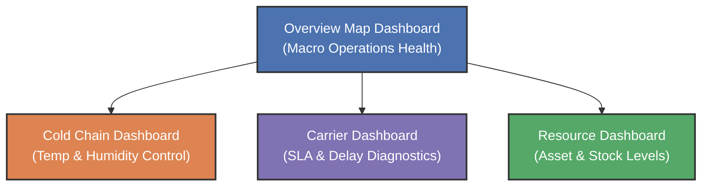

# Telling an IoT Logistics Story in Tableau

This document outlines the visual design, data preparation, storyboard dashboard layout, and talking points for building a premium **Tableau Story** based on the IoT sensor and shipment dataset analyzed in [week7_LinePlotofIoTSensorReadingsOverTime.ipynb](file:///Users/brianjancarlos/codestuff/MMDC/ADET/adet/week7_LinePlotofIoTSensorReadingsOverTime.ipynb).

---

## 1. The Core Narrative Arc

The story is designed for a **Logistics Operations Director** or **Supply Chain Manager**. It transitions from a macro overview of operations to micro analyses of temperature-critical failures, carrier reliability, and resource efficiency.



---

## 2. Tableau Storyboard Breakdown

### Dashboard 1: Executive Operations Overview
* **Objective:** Understand the current geographical footprint and operational status of Japan deliveries.
* **Visual Structure:**
  * **Map Visual:** A Map of Japan using `Latitude` & `Longitude` (Detail on `Current Location`). Color mark by `Package Status` (To Ship, In Transit, Delivered, Delayed, Cancelled). 
  * **KPI Summary Cards (Top Row):**
    * *Active Shipments* (`COUNTD(Package ID)`)
    * *Delay Rate* (`SUM(Logistics Delay) / COUNT(Package ID)`)
    * *Average Wait Time* (`AVG(Waiting Time Minutes)`)
    * *Tamper Alert Rate* (`% of Yes answers in Tamper Alert`)
* **Talking Points:**
  > *“Today we are tracking X shipments across Japan. Our active delay rate is currently at Y%, with hotspots concentrated in Prefecture regions like Kanagawa and Osaka due to sudden traffic and detours. Let's dive deeper into where quality issues are arising.”*

---

### Dashboard 2: Cold Chain & Quality Control
* **Objective:** Identify quality exceptions in transit, specifically looking at perishable goods.
* **Visual Structure:**
  * **Dual-Axis Linear Line Chart (aggregated hourly):** 
    * Columns: `Continuous Timestamp (Hour)`
    * Rows: `Temperature` (Left axis) and `Humidity` (Right axis)
    * Color: `Perishable` (Yes/No)
  * **Reference Bands (Temperature):** Add a reference band on the Temperature axis from **0°C to 8°C** to show the acceptable cold-chain margin.
  * **Alert Shapes:** Place shape markers (e.g., Red Exclamation points) on the timeline when `Tamper Alert = Yes` or `RFID Verified = False`.
* **Talking Points:**
  > *“Our cold chain integrity is crucial. As seen in the hourly temperature timeline, several perishable packages in storage or delayed status experienced excursions exceeding 8°C. These coincide directly with traffic delays, showing a clear dependency between route scheduling and quality maintenance.”*

---

### Dashboard 3: Carrier Performance & Delay Root Causes
* **Objective:** Compare carrier efficiency to renegotiate SLAs and optimize routing options.
* **Visual Structure:**
  * **Box-and-Whisker Plot:** 
    * Columns: `Carrier` (Yamato Transport, Japan Post, Sagawa Express)
    * Rows: `Waiting Time Minutes`
    * Detail: `Package ID`
  * **Stacked Bar Chart:** 
    * Columns: `Carrier`
    * Rows: `Number of Records`
    * Color: `Logistics Delay Reason` (Address Unknown, Traffic, Weather, etc.)
* **Talking Points:**
  > *“When analyzing carrier reliability, Sagawa shows a tighter distribution of waiting times, whereas Japan Post has a wider spread with delays mostly driven by 'Address Unknown' issues. We can target specific remediation strategies for each vendor partners.”*

---

### Dashboard 4: Resource & Capacity Optimization
* **Objective:** Synchronize warehouse stock levels with transportation fleet deployment.
* **Visual Structure:**
  * **Scatter Plot:**
    * X-axis: `Inventory Level`
    * Y-axis: `Asset Utilization (%)`
    * Detail: `Prefecture`
    * Size: `Average Waiting Time`
  * **Reference Lines:** Horizontal line at 80% Asset Utilization (representing standard baseline target).
* **Talking Points:**
  > *“To optimize resources, we look at how warehouse inventory corresponds to truck utilization. We see locations in Kanagawa and Hokkaido with low utilization but high inventory levels, indicating a dispatch bottleneck. By realigning scheduling, we can increase asset utilization past our 80% benchmark.”*

---

## 3. Data Preparation Steps in Tableau

To replicate the data preparation steps completed in the Jupyter Notebook [week7_LinePlotofIoTSensorReadingsOverTime.ipynb](file:///Users/brianjancarlos/codestuff/MMDC/ADET/adet/week7_LinePlotofIoTSensorReadingsOverTime.ipynb), implement the following calculations in Tableau:

### A. Standardizing Package Status
The original raw `Latest Status` column is highly detailed. Create a Calculated Field named `Package Status` to group them:
```sql
CASE LOWER(TRIM([Latest Status]))
  WHEN 'delivered to the delivery address' THEN 'Delivered'
  WHEN 'returned due to absence' THEN 'Cancelled'
  WHEN 'bring it back due to your absence' THEN 'Delayed'
  WHEN 'under investigation' THEN 'Delayed'
  WHEN 'address unknown' THEN 'Delayed'
  WHEN 'storage' THEN 'To Ship'
  WHEN 'hold' THEN 'To Ship'
  ELSE 'In Transit'
END
```

### B. Time Aggregation (Hourly Floor)
To clean up line charts and reduce noise, create a calculated field for hourly granularity:
```sql
DATETRUNC('hour', [Timestamp])
```

---

## 4. Marp Presentation Slides

Below is the **Marp** markdown formatting to create presentation slides based on this Tableau Story:

```markdown
---
marp: true
theme: gaia
_class: lead
paginate: true
backgroundColor: #1e293b
color: #f8fafc

# IoT Logistics Operations in Japan
## Cold Chain & Performance Analysis in Tableau
---

# Narrative Goal
- **Identify Bottlenecks:** Locate operational delays.
- **Maintain Cold Chain:** Pinpoint temperature exceptions for perishable goods.
- **Optimize Assets:** Balance inventory levels and fleet utilization.

---

# Slide 1: Network Health Overview
- **Visual:** Map of Japan with active carrier pathways.
- **KPIs:** Active delay rate, overall waiting times.
- **Insight:** Hotspots in Kanagawa and Osaka regions require detour optimization.

---

# Slide 2: Keeping Perishables Cold
- **Visual:** Dual-axis timeline of temperature & humidity.
- **Thresholds:** Reference bands highlighting when temperature > 8°C.
- **Action:** Intervene on transit routes where delayed packages risk spoiling.

---

# Slide 3: Carrier Benchmarking
- **Visual:** Boxplot of waiting times by carrier.
- **Diagnostics:** Root causes of carrier delays (Traffic vs. Address Unknown).
- **Action:** Re-negotiate SLAs with carriers under-performing in specific prefectures.

---

# Slide 4: Resource Efficiency
- **Visual:** Scatter plot of Inventory Levels vs. Asset Utilization.
- **Target:** Meet the 80% fleet utilization goal.
- **Opportunity:** Resolve warehouse dispatch bottlenecks where stocks are high but trucks run empty.
```
