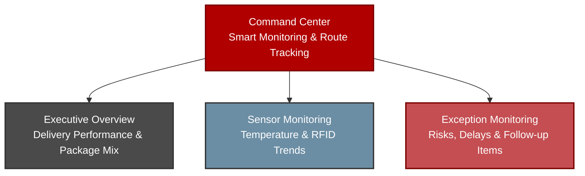

# Tableau Storytelling Guide: Kaizen Logistics Smart Monitoring & Tracking

This document outlines the visual design, dashboard structure, data preparation approach, and presentation talking points for the **Kaizen Logistics Smart Package Monitoring & Tracking Dashboard** in Tableau.

The Tableau dashboard uses a dedicated visualization dataset built from the Kaizen Logistics IoT package records. It is separate from the Week 6 homework output so the dashboard can support route paths, event-level tracking, tooltips, filters, and multi-page storytelling.

## Tableau Public Dashboard

Published dashboard:

[Kaizen Logistics Smart Package Monitoring & Tracking Dashboard](https://public.tableau.com/views/MO-IT148Milestone2SmartTrackingSystemDashboardSubmissionS3101TeamKaizen/MAINDASHBOARD?:language=en-US&:sid=&:redirect=auth&:display_count=n&:origin=viz_share_link)

## 1. Core Narrative Arc

The dashboard story is designed for logistics managers, operations leads, and stakeholders who need to understand package movement, delivery performance, IoT temperature condition, and RFID tracking reliability across Japan.



The story answers four main questions:

1. **Where are packages moving across Japan?**
2. **How well is Kaizen Logistics performing against delivery and tracking goals?**
3. **Are package temperatures staying within acceptable conditions?**
4. **Which packages require operational attention?**

## 2. Dashboard Pages

### Dashboard 1: Kaizen Logistics Smart Package Monitoring & Tracking Dashboard

**Objective:** Provide a command-center view of package movement, core KPIs, and IoT temperature conditions.

**Recommended title:**

```text
Kaizen Logistics Smart Package Monitoring & Tracking Dashboard
```

**Subtitle:**

```text
IoT-enabled and blockchain-backed package monitoring across Japan
```

**Main visuals:**

- KPI cards:
  - Total Packages
  - Delivery Rate
  - Average Temperature
  - Perishable Packages
- Japan smart shipment route map:
  - route lines show package movement
  - event points show tracking stages
  - tooltips show package, location, temperature, status, and RFID information
- IoT Temperature Condition by Journey Stage:
  - stacked vertical bar chart
  - compares Ambient, Cool, and Danger Zone readings by event status
- Temperature Condition Distribution:
  - donut chart showing overall Ambient, Cool, and Danger Zone share
- Smart Monitoring Summary:
  - short explanation panel that helps users understand the page

**Main dashboard talking point:**

> “This command center gives a real-time-style view of Kaizen Logistics operations. The route map traces package movement across Japan, while the KPI cards and temperature charts summarize package performance and condition throughout the delivery journey.”

---

### Dashboard 2: Executive Overview

**Objective:** Summarize business-level delivery performance, package volume, package mix, and tracking reliability.

**Suggested visuals:**

- KPI cards:
  - Total Packages
  - Delivery Rate
  - Delivered Packages
  - In Transit Packages
  - Exception Packages
  - Average RFID Success %
- Package count by final status
- Package count by order week
- Perishable vs non-perishable package distribution
- Average temperature by final status
- RFID reliability distribution
- Temperature condition distribution

**Talking point:**

> “The executive overview summarizes overall logistics performance. It shows whether the operation is meeting expected service levels through delivery rate, exception count, perishable handling, temperature condition, and RFID reliability.”

---

### Dashboard 3: Sensor Monitoring

**Objective:** Analyze IoT readings and RFID reliability over time.

**Suggested visuals:**

- Temperature over time by final status
- Temperature over time by perishable type
- RFID success over time by final status
- Temperature issue by event status
- Optional dual-axis view for temperature and RFID success

**Recommended chart labels:**

- `Temperature (°C)` for temperature axes
- `RFID Success Rate (%)` for RFID axes
- Use continuous `event_timestamp` for time-series charts

**Talking point:**

> “The sensor monitoring dashboard focuses on how IoT readings change over time. Temperature trends help identify possible package condition risks, while RFID success trends show whether tracking reliability remains stable throughout the package journey.”

---

### Dashboard 4: Exception Monitoring

**Objective:** Identify shipments that may require follow-up due to delivery exceptions, temperature risk, or RFID reliability concerns.

**Suggested visuals:**

- KPI cards:
  - Exception Packages
  - Not Delivered Packages
  - Danger Zone Packages
  - RFID At-Risk Packages
  - Average RFID Failure %
- Delivery exception reasons
- At-risk packages by temperature issue
- Top packages by RFID failure percentage
- Exception package detail table
- Optional exception-only map

**Talking point:**

> “The exception monitoring page highlights packages that need operational attention. It helps users identify not-delivered shipments, danger-zone temperature readings, and RFID reliability issues that may require follow-up.”

## 3. Tableau Data Source Strategy

The Tableau dashboard is best built using a single event-level CSV:

```text
tableau_kaizen_logistics_tracking_events.csv
```

This dataset is designed for dashboard interactivity and route mapping. It should contain multiple rows per package, where each row represents a tracking event.

Example route sequence:

```text
Order Placed → Picked Up → In Transit → Out for Delivery → Delivered / In Transit / Not Delivered
```

Recommended fields:

```text
package_id
tracking_number
event_order
event_type
event_status
event_timestamp
event_location
event_city
event_prefecture
event_latitude
event_longitude
map_path_id
map_path_order
origin_location
origin_city
origin_prefecture
origin_latitude
origin_longitude
delivery_location
delivery_city
delivery_prefecture
delivery_latitude
delivery_longitude
final_status
perishable
event_temperature
event_temperature_issue
rfid_number
rfid_verified
rfid_failure_percent
rfid_failure_label
rfid_success_percent
rfid_success_label
delivery_exception_reason
order_week
```

## 4. Map Design Notes

The route map should use a dual-layer approach:

1. **Route lines**
   - mark type: Line
   - detail: `map_path_id`, `package_id`
   - path: `map_path_order`
   - color: muted gray or final status
   - size: thin
   - opacity: low to medium

2. **Tracking event points**
   - mark type: Circle
   - color: `event_status`
   - tooltip: package, event, location, timestamp, temperature, RFID, final status, and exception reason

Recommended map title:

```text
Japan Smart Shipment Route Map
```

Recommended tooltip:

```text
Package ID: <Package Id>
Tracking No.: <Tracking Number>

Event: <Event Type>
Event Status: <Event Status>
Final Status: <Final Status>

Location: <Event Location>
City/Prefecture: <Event City>, <Event Prefecture>
Timestamp: <Event Timestamp>

Temperature: <Event Temperature> °C
Temperature Issue: <Event Temperature Issue>

RFID Success: <Rfid Success Percent>%
RFID Reliability: <Rfid Success Label>

Exception Reason: <Delivery Exception Reason>
```

## 5. Recommended Color Scheme

The dashboard uses a dark red, white, and light gray theme.

### Base theme colors

| Use | Hex |
|---|---:|
| Brand dark red | `#B00000` |
| Dark maroon | `#7A0000` |
| White panel | `#FFFFFF` |
| Light gray background | `#E6E6E6` |
| Medium gray border | `#C9C9C9` |
| Dark text | `#333333` |

### Temperature condition colors

| Temperature Issue | Hex |
|---|---:|
| Ambient | `#BFC0C0` |
| Cool | `#6C8EA4` |
| Danger Zone | `#B00000` |

### Event status colors

| Event Status | Hex |
|---|---:|
| Order Placed | `#BFC0C0` |
| Picked Up | `#D9A441` |
| In Transit | `#A65E00` |
| Out for Delivery | `#9E3D3F` |
| Delivered | `#5E6F64` |
| Not Delivered | `#B00000` |

For the main dashboard map, route lines should be muted so the all-packages view remains readable.

Recommended route line setting:

```text
Color: #8A8A8A
Opacity: 35% to 45%
Size: thin
```

## 6. Benchmark and Target Suggestions

Use benchmark notes in KPI titles, subtitles, or tooltips.

| Metric | Suggested Target |
|---|---:|
| Delivery Rate | `≥ 95%` |
| Average RFID Success % | `≥ 97%` |
| Exception Packages | `≤ 5 packages` |
| Danger Zone Packages | `≤ 5 packages` |
| Average Temperature | `≤ 25°C` as a general monitoring guide |

Example KPI tooltip:

```text
Metric: Delivery Rate
Target: ≥ 95%
Interpretation: Measures the percentage of unique packages successfully delivered.
```

## 7. Dashboard Interactivity

Recommended global filters:

```text
package_id
final_status
event_status
perishable
event_temperature_issue
rfid_success_label
event_timestamp
order_week
```

Recommended dashboard actions:

- Select a route or event point on the map to filter related charts.
- Select a status bar to filter the map and detail tables.
- Select a temperature condition to focus on Ambient, Cool, or Danger Zone events.
- Use `package_id` to inspect one package journey from origin to final status.

## 8. Presentation Flow

Suggested presentation order:

1. **Command Center** - show the full operational view and Japan route map.
2. **Executive Overview** - explain business performance and package mix.
3. **Sensor Monitoring** - explain temperature and RFID behavior over time.
4. **Exception Monitoring** - show risk detection and operational follow-up.

Final summary script:

> “The Tableau dashboard connects the blockchain-backed IoT data pipeline to a practical logistics monitoring use case. It allows Kaizen Logistics to monitor package movement across Japan, track package condition through IoT temperature readings, evaluate RFID reliability, and identify shipments requiring operational attention.”

## 9. Marp Presentation Outline

```markdown
---
marp: true
theme: gaia
_class: lead
paginate: true
backgroundColor: #7A0000
color: #ffffff

# Kaizen Logistics Smart Monitoring & Tracking
## IoT-enabled and blockchain-backed package monitoring across Japan
---

# Dashboard 1: Command Center
- Japan route map shows package movement.
- KPI cards summarize delivery rate, package volume, average temperature, and perishable package count.
- Temperature charts show Ambient, Cool, and Danger Zone conditions.

---

# Dashboard 2: Executive Overview
- Summarizes delivery performance and package distribution.
- Uses benchmark targets for delivery rate and RFID reliability.
- Highlights overall logistics performance.

---

# Dashboard 3: Sensor Monitoring
- Shows temperature trends over time.
- Compares sensor behavior by final status and perishable package type.
- Tracks RFID success rate as a reliability metric.

---

# Dashboard 4: Exception Monitoring
- Identifies packages requiring follow-up.
- Shows delivery exceptions, temperature risks, and RFID concerns.
- Supports operational decision-making.
```
