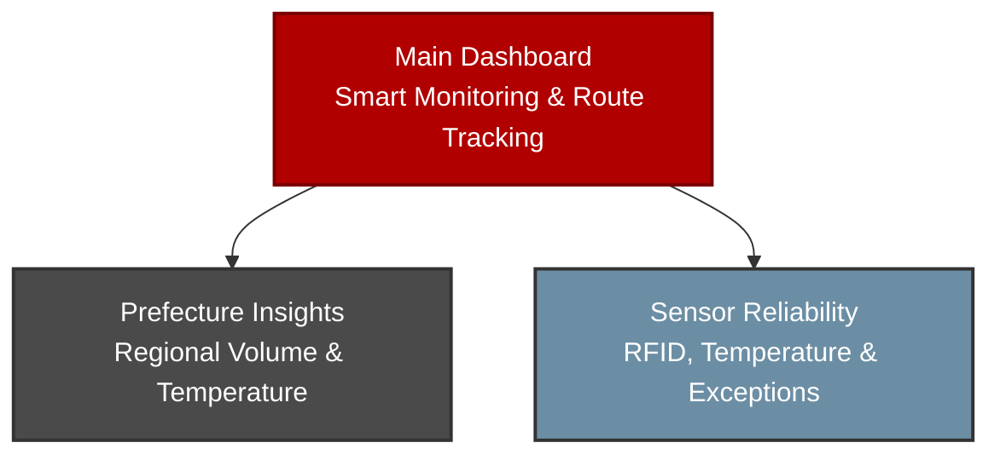

# Tableau Storytelling Guide: Kaizen Logistics Smart Monitoring & Tracking

This document outlines the visual design, dashboard structure, data preparation approach, and presentation talking points for the **Kaizen Logistics Smart Package Monitoring & Tracking Dashboard** in Tableau.

The Tableau dashboard uses a dedicated visualization dataset built from the Kaizen Logistics IoT package records. It is separate from the Week 6 homework output so the dashboard can support route paths, event-level tracking, tooltips, filters, and multi-page storytelling.

## Tableau Public Dashboard

Published dashboard:

[Kaizen Logistics Smart Package Monitoring & Tracking Dashboard](https://public.tableau.com/views/MO-IT148Milestone2SmartTrackingSystemDashboardSubmissionS3101TeamKaizen/MAINDASHBOARD?:language=en-US&:sid=&:redirect=auth&:display_count=n&:origin=viz_share_link)

## 1. Core Narrative Arc

The dashboard story is designed for logistics managers, operations leads, and stakeholders who need to understand package movement, delivery performance, IoT temperature condition, delivered-prefecture coverage, and RFID tracking reliability across Japan.



The final three-page story answers three main questions:

1. **Where are packages moving across Japan and how are shipments performing overall?**
2. **Which delivered prefectures show higher package activity and temperature concerns?**
3. **Which packages or sensor signals require operational review?**

## 2. Dashboard Pages

### Dashboard 1: Kaizen Logistics Smart Package Monitoring & Tracking Dashboard

**Objective:** Provide a command-center view of package movement, core KPIs, and IoT temperature conditions.

**Recommended title:**

```text
Kaizen Logistics Smart Package Monitoring & Tracking Dashboard
```

**Subtitle:**

```text
IoT-enabled and blockchain-backed package monitoring across Japan
```

**Main visuals:**

- KPI cards:
  - Total Packages
  - Delivery Rate
  - Average Temperature
  - Perishable Packages
- Japan Smart Shipment Route Map:
  - route lines show package movement
  - event points show tracking stages
  - tooltips show package, location, temperature, status, and RFID information
- IoT Temperature Condition by Journey Stage:
  - stacked vertical bar chart
  - compares Ambient, Cool, and Danger Zone readings by event status
- Temperature Condition Distribution:
  - donut chart showing overall Ambient, Cool, and Danger Zone share
- Dashboard Summary and Temperature Monitoring Insight text panels

**Main dashboard talking point:**

> “This command center gives an overall view of package movement, delivery performance, and IoT temperature monitoring across Japan. The route map traces package journeys, while the KPI cards and temperature charts summarize package condition throughout the delivery journey.”

---

### Dashboard 2: Kaizen Logistics Prefecture Operations & Temperature Insights

**Objective:** Compare delivered-prefecture coverage, package volume, average temperature, and Danger Zone readings across regional delivery areas.

**Main visuals:**

- KPI cards:
  - Delivered Prefectures
  - Avg. Prefecture Temp
  - Danger Zone Packages
- Top 10 Package Volume by Prefecture and Temperature Condition
- Top 10 Average Temperature by Prefecture
- Top 10 Package Density by Prefecture
- Sidebar insight and filters:
  - Event Temperature Issue
  - Final Delivery Status

**Design notes:**

- “Delivered Prefectures” refers to the number of Japanese prefectures where Kaizen Logistics recorded package deliveries in the dataset.
- Top 10 views are used to reduce visual clutter and focus on the most active delivery prefectures.
- Tooltips disclose that values are affected by selected filters and should be interpreted within the current dashboard selection.

**Talking point:**

> “The Prefecture Insights page highlights where Kaizen Logistics has delivery coverage and which active prefectures show higher package volume or temperature concerns. Top 10 views keep the regional comparison readable while filters allow users to focus on temperature condition and final delivery status.”

---

### Dashboard 3: Kaizen Logistics IoT Sensor Reliability & Exception Monitoring

**Objective:** Evaluate RFID reliability, delivery exceptions, temperature movement, and packages requiring operational review.

**Main visuals:**

- KPI cards:
  - In Transit
  - Not Delivered
  - Avg. RFID Success %
  - RFID At-Risk Packages
- RFID Success Rate Over Time
- Temperature Trend by Journey Stage & Delivery Status
- Packages Requiring Operational Review
- RFID Reliability Distribution
- Sensor reliability summary and insight text panels

**Benchmark and risk notes:**

- RFID success is interpreted against a 97% target.
- RFID At-Risk Packages counts unique packages classified as At Risk based on RFID reliability.
- Packages Requiring Operational Review ranks packages using combined package-level risk signals such as unresolved delivery status, Danger Zone temperature reading, and RFID At-Risk label.

**Talking point:**

> “The Sensor Reliability page closes the dashboard story by identifying packages and time periods that may require review. It combines RFID success, delivery status, temperature movement, and package-level risk scoring to support operational follow-up.”

---

## 3. Tableau Data Source Strategy

The Tableau dashboard is best built using a single event-level CSV:

```text
assets/tableau_kaizen_logistics_tracking_events.csv
```

This dataset is designed for dashboard interactivity and route mapping. It should contain multiple rows per package, where each row represents a tracking event.

Example route sequence:

```text
Order Placed → Picked Up → In Transit → Out for Delivery → Delivered / In Transit / Not Delivered
```

Recommended fields:

```text
package_id
tracking_number
event_order
event_type
event_status
event_timestamp
event_location
event_city
event_prefecture
event_latitude
event_longitude
map_path_id
map_path_order
origin_location
origin_city
origin_prefecture
origin_latitude
origin_longitude
delivery_location
delivery_city
delivery_prefecture
delivery_latitude
delivery_longitude
final_status
perishable
event_temperature
event_temperature_issue
rfid_number
rfid_verified
rfid_failure_percent
rfid_failure_label
rfid_success_percent
rfid_success_label
delivery_exception_reason
order_week
```

## 4. Map Design Notes

The route map should use a dual-layer approach:

1. **Route lines**
   - mark type: Line
   - detail: `map_path_id`, `package_id`
   - path: `map_path_order`
   - color: muted gray or final status
   - size: thin
   - opacity: low to medium

2. **Tracking event points**
   - mark type: Circle
   - color: `event_status`
   - tooltip: package, event, location, timestamp, temperature, RFID, final status, and exception reason

Recommended map title:

```text
Japan Smart Shipment Route Map
```

Recommended tooltip:

```text
Package ID: <Package Id>
Tracking No.: <Tracking Number>

Event: <Event Type>
Event Status: <Event Status>
Final Status: <Final Status>

Location: <Event Location>
City/Prefecture: <Event City>, <Event Prefecture>
Timestamp: <Event Timestamp>

Temperature: <Event Temperature> °C
Temperature Issue: <Event Temperature Issue>

RFID Success: <Rfid Success Percent>%
RFID Reliability: <Rfid Success Label>

Exception Reason: <Delivery Exception Reason>
```

## 5. Recommended Color Scheme

The dashboard uses a dark red, white, and light gray theme.

### Base theme colors

| Use | Hex |
|---|---:|
| Brand dark red | `#B00000` |
| Dark maroon | `#7A0000` |
| White panel | `#FFFFFF` |
| Light gray background | `#E6E6E6` |
| Medium gray border | `#C9C9C9` |
| Dark text | `#333333` |

### Temperature condition colors

| Temperature Issue | Hex |
|---|---:|
| Ambient | `#BFC0C0` |
| Cool | `#6C8EA4` |
| Danger Zone | `#B00000` |

### Event status colors

| Event Status | Hex |
|---|---:|
| Order Placed | `#BFC0C0` |
| Picked Up | `#D9A441` |
| In Transit | `#A65E00` |
| Out for Delivery | `#9E3D3F` |
| Delivered | `#5E6F64` |
| Not Delivered | `#B00000` |

For the main dashboard map, route lines should be muted so the all-packages view remains readable.

Recommended route line setting:

```text
Color: #8A8A8A
Opacity: 35% to 45%
Size: thin
```

## 6. Benchmark and Target Suggestions

Use benchmark notes in KPI titles, subtitles, or tooltips.

| Metric | Suggested Target |
|---|---:|
| Delivery Rate | `≥ 95%` |
| Average RFID Success % | `≥ 97%` |
| Exception Packages | `≤ 5 packages` |
| Danger Zone Packages | `≤ 5 packages` |
| Average Temperature | `≤ 25°C` as a general monitoring guide |

Example KPI tooltip:

```text
Metric: Delivery Rate
Target: ≥ 95%
Interpretation: Measures the percentage of unique packages successfully delivered.
```

## 7. Tooltip and Explanation Strategy

The final dashboard uses customized tooltips to help viewers understand dynamic KPI values and filtered chart results.

Tooltip principles:

- Use dynamic field inserts from Tableau instead of hardcoded values when filters can change results.
- Explain whether a KPI counts unique packages, event records, or prefectures.
- Add benchmark notes where relevant, such as Delivery Rate `≥ 95%` and RFID Success `≥ 97%`.
- Add scope notes for Top 10 regional charts so viewers know the values are based on the current dashboard selection.
- Add filter notes when KPIs and charts are affected by selected filters.
- Use navigation button tooltips to clarify the purpose of each dashboard page.

Examples:

```text
Delivery Rate: <Delivery Rate>

This measures the percentage of packages that reached Delivered final status based on the current dashboard selection.

Target:
Delivery Rate should remain at 95% or higher.
```

```text
Top 10 views are used to improve dashboard readability and highlight the most active delivery prefectures. Values may change based on selected filters and should be interpreted within the current dashboard view.
```

## 8. Dashboard Interactivity

Recommended global filters:

```text
package_id
final_status
event_status
perishable
event_temperature_issue
rfid_success_label
event_timestamp
order_week
```

Recommended dashboard actions:

- Select a route or event point on the map to filter related charts.
- Select a status bar to filter the map and detail tables.
- Select a temperature condition to focus on Ambient, Cool, or Danger Zone events.
- Use `package_id` to inspect one package journey from origin to final status.

## 9. Presentation Flow

Suggested presentation order:

1. **Main Dashboard** - show the full operational view, package KPIs, and Japan route map.
2. **Prefecture Insights** - explain delivered-prefecture coverage, Top 10 regional volume, average temperature, package density, and Danger Zone monitoring.
3. **Sensor Reliability** - explain RFID performance, delivery exceptions, journey-stage temperature trends, and packages requiring operational review.

Final summary script:

> “The Tableau dashboard connects the blockchain-backed IoT data pipeline to a practical logistics monitoring use case. It allows Kaizen Logistics to monitor package movement across Japan, compare delivery prefectures by package volume and temperature condition, evaluate RFID reliability, and identify packages requiring operational attention.”

## 10. Marp Presentation Outline

```markdown
---
marp: true
theme: gaia
_class: lead
paginate: true
backgroundColor: #7A0000
color: #ffffff

# Kaizen Logistics Smart Monitoring & Tracking
## IoT-enabled and blockchain-backed package monitoring across Japan
---

# Dashboard 1: Main Dashboard
- Japan route map shows package movement.
- KPI cards summarize delivery rate, package volume, average temperature, and perishable package count.
- Temperature charts show Ambient, Cool, and Danger Zone conditions across the journey.

---

# Dashboard 2: Prefecture Insights
- Shows delivered-prefecture coverage across Japan.
- Compares Top 10 package volume, average temperature, and package density by prefecture.
- Uses temperature and delivery status filters for focused regional analysis.

---

# Dashboard 3: Sensor Reliability
- Tracks RFID success rate against the 97% target.
- Compares temperature movement by journey stage and delivery status.
- Identifies packages requiring operational review using combined risk signals.

---

# Closing
- The dashboard supports route tracking, regional temperature monitoring, RFID reliability analysis, and operational exception review.
```
